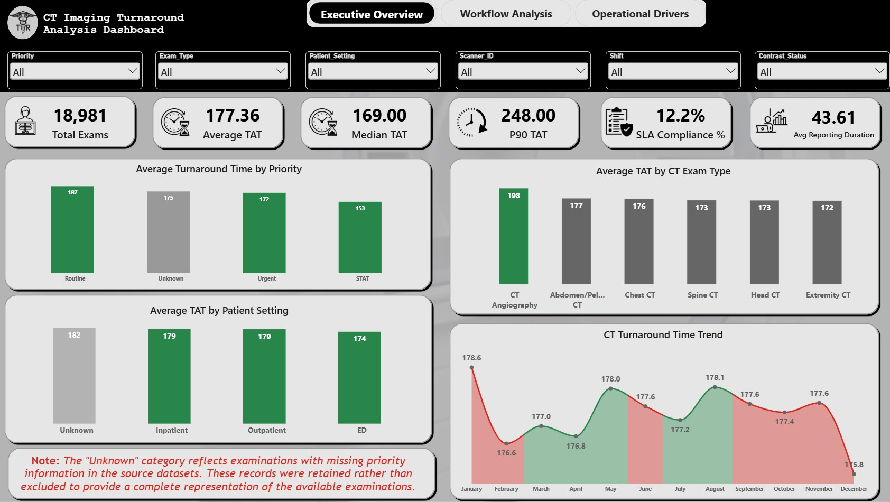
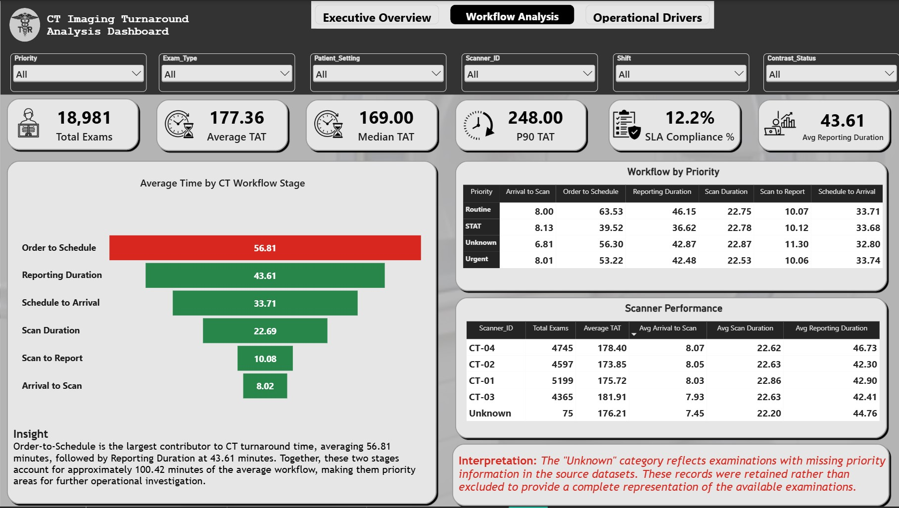
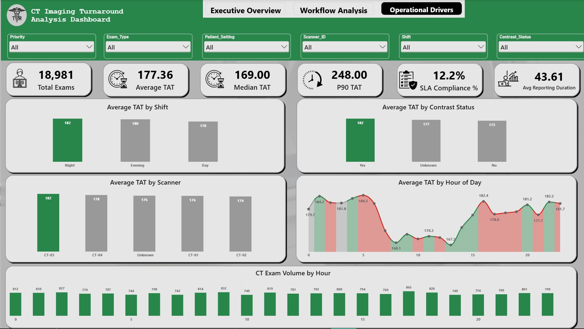
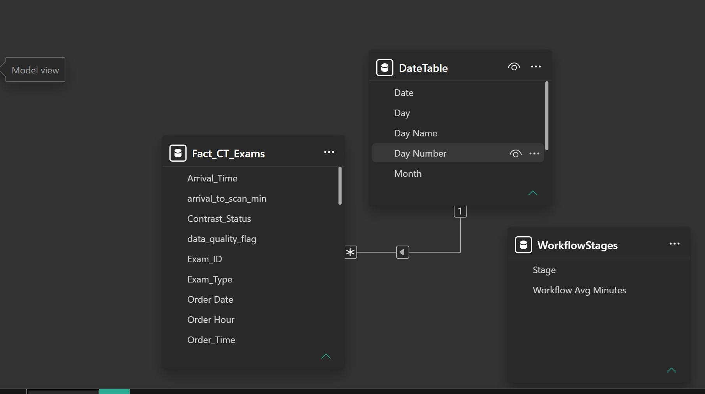

# CT Imaging Turnaround Time & Radiology Workflow Analysis

**<p align="justify">An end-to-end healthcare operations analysis: SQL, Power BI, and a conclusion that contradicted the obvious answer.**
</p>


<p align="justify">
A radiology department knows something is wrong. CT results are unpredictable. One patient gets a scan and a signed report inside two hours; another waits half a day for the same exam. Nobody can say why, because nobody has ever measured the workflow in pieces. </p>

The scanner is an obvious place to look first.

<p align="justify">This project takes 20,000 CT examinations apart, stage by stage, and asks the data where the time actually goes. The answer turned out to be somewhere else entirely. </P>

> ### A note on the data before you read further
>
> **This project uses a synthetic dataset. There are no real patients here, no real clinicians, and no real hospital records. Nothing in it was derived from, sampled from, or de-identified out of an actual health record system.**
>
> <p align="justify">The data was generated on purpose to behave like a real radiology department, including the messy parts. Duplicates, blank fields, inconsistent spellings, and timestamps that run backwards were all built in deliberately, because cleaning a dataset that arrives perfect proves nothing. The script that made it, defects and all, is in [`data/generate_dataset.py`](data/generate_dataset.py). Every finding below describes this synthetic dataset and should not be read as a claim about any real hospital. </p>

---

## The dashboard

| Executive Overview | Workflow Analysis | Operational Drivers |
|---|---|---|
|  |  |  |

<p align="justify">Three pages in Power BI, cross-filtered on priority, exam type, patient setting, scanner, shift, and contrast status. Every page reads the same curated SQL view, so no number on screen was calculated twice in two places. </p>

Behind it sits a star schema:



<p align="justify">`Fact_CT_Exams` holds one row per examination with its stage durations already computed in SQL. `DateTable` is a proper date dimension built in DAX and joined one-to-many on order date, which is what makes the time intelligence work. `WorkflowStages` holds the six stage names so the stage comparison renders as one ranked visual instead of six unrelated cards. Because the durations are calculated upstream, the model stays thin and the measures stay simple.</p>

---

## The question
<p align="justify">
CT turnaround times were inconsistent, and the department had no visibility into why. Without a breakdown of the workflow into measurable pieces, leadership could not tell whether the delay lived in scheduling, in the scan itself, or in the radiologist's reading queue.
</p>
<p align="justify">That gap has real costs. Improvement effort gets aimed at the wrong target. Staffing and equipment decisions get made on instinct. And nobody can give a referring physician an honest answer about when a result will land.</p>

So the question was simple to state and harder to answer:

> **Where in the CT workflow is time actually being lost, and what explains the difference between a fast exam and a slow one?**

<p align="justify">One condition shaped everything that followed. **No bottleneck was assumed in advance.** Every stage got measured independently and the data decided. That constraint is the reason the project reached a conclusion nobody expected.</p>

---

## What the data looked like when it arrived

Before any analysis, the dataset had to be trusted. It could not be, at first.

### The 60 records that vanished without an error

The first load into MySQL brought in 20,015 rows. The source file has 20,075.

Sixty records disappeared, and nothing said so. The import reported success.

<p align="justify">Here is what happened. The timestamp columns had been declared as `DATETIME`. Sixty exams legitimately had a blank report-finalized time, because the report was never signed off. Rather than storing those blanks as `NULL`, the import wizard threw the entire row away.</p>

The consequence is worth sitting with for a second. Had this gone unnoticed, this query would have returned zero:

```sql
SELECT COUNT(*) FROM ct_imaging_raw
WHERE Report_Finalized_Time IS NULL;
```

<p align="justify">Zero unfinalized reports. A perfect completion rate. Every record capable of proving otherwise had already been deleted, silently, by the tool that was supposed to load them.</p>

<p align="justify">It surfaced for one reason only: the loaded row count was compared against the source file. Nothing in the software's output hinted at a problem.</p>

<p align="justify">The fix was to rebuild the load in two layers. First, a staging table where every column is plain text, so nothing can be rejected on type. Then a typed conversion under explicit control, mapping blanks to `NULL` rather than discarding the row. All 20,075 records now arrive, and the missing report timestamps survive as `NULL` where they can be counted and reasoned about.</p>

**<p align="justify">
Row-count reconciliation now runs on every load, before anything else.** It is the cheapest check in the pipeline and it caught the most expensive problem.
</p>
### Everything else that was wrong with it

<p align="justify">Profiling came before cleaning, always. Every transformation below is justified by a measurement taken first.</p>

| What was wrong | How many | What was done about it |
|---|---:|---|
| The same `Exam_ID` appearing twice | 75 | Window function, earliest order kept |
| `Priority` spelled six ways for three categories | 219 | Standardized to Routine, Urgent, STAT |
| `Contrast_Status` spelled four ways for two | 181 | Trimmed and standardized to Yes, No |
| Blank `Contrast_Status` | 119 | Kept, shown as `Unknown` |
| Blank `Scanner_ID` | 80 | Kept, shown as `Unknown` |
| Blank `Patient_Setting` | 80 | Kept, shown as `Unknown` |
| Blank `Report_Finalized_Time` | 60 | Kept as `NULL`, left out of turnaround |
| Blank `Priority` | 59 | Kept, shown as `Unknown` |
| Scheduled before it was ordered | 35 | Flagged `Invalid` |
| Scan ended before it started | 80 | Flagged `Invalid` |
| Report started before the scan finished | 60 | Flagged `Invalid` |

<p align="justify">
The category problems are the sneaky kind. `Priority` arrived as `Routine`, `routine`, `Urgent`, `URGENT`, `STAT`, and `Stat`. Contrast status included `"No "` with a trailing space, which looks identical to `No` in any result grid you will ever open. Left alone, every grouped query would have split each real category across several rows and quietly understated all of them.</p>

<p align="justify">The duplicates turned out to be reassuring rather than alarming. All 75 pairs are byte-for-byte identical across all 18 fields and share the same order timestamp. They are load artifacts, not two versions of the truth. That means the tie-break rule used to remove them is arbitrary and provably safe, because either copy gives the same answer.</p>

### Two decisions worth defending

**<p align="justify">Records with missing categories were kept, not deleted.** They are real completed examinations. Dropping them would have pulled genuine exams out of the volume counts and biased every average, invisibly. They appear instead as an explicit `Unknown` category, so the gap in the data is something you can see rather than something that quietly moved the numbers.</p>
**<p align="justify">
Impossible timestamps were flagged, not fixed.** There is no honest way to invent a timestamp. Any repair would be a made-up value wearing the costume of a measurement. Flagging keeps the exclusion auditable: the count is queryable at any time and the decision can be revisited without reloading anything.
</p>
### Where the 20,075 rows went

| Step | Records | Lost | Why |
|---|---:|---:|---|
| Loaded from source | 20,075 | | |
| After removing duplicates | 20,000 | 75 | Repeated `Exam_ID` |
| Completed exams only | 19,206 | 794 | 400 canceled, 394 no-show |
| Passing the chronology checks | 19,037 | 169 | Flagged `Invalid` |
| **With a finalized report** | **18,981** | 56 | Report never signed off |

<p align="justify">Every excluded record is accounted for. The 794 canceled and no-show exams cannot have a turnaround time, so they sit outside the KPIs, but they are reported on their own as a demand-loss figure. They represent booked capacity that produced nothing clinical, which is exactly the kind of number that vanishes if you only ever measure the exams that happened.</p>

Full detail: [`docs/data_quality_log.md`](docs/data_quality_log.md)

---

## How it was built

Six SQL scripts, each with one job:

```
CT_Imaging_Raw_Data.csv
    │
    ├─ 01  Ingestion       staging table, then a typed load that loses nothing
    ├─ 02  Profiling       counts, duplicates, blanks, categories, chronology
    ├─ 03  Cleaning        de-duplication and standardization
    ├─ 04  Metrics         six stage durations, total turnaround, quality flags
    ├─ 05  KPIs            headline numbers and the agreed business questions
    └─ 06  Advanced        variance, confounding, effect sizes, tiered SLA
                │
                └─  vw_ct_kpi_ready  →  Power BI
```

The CT process splits into six intervals that follow each other in a fixed order and add up to the whole journey:

**Order → Schedule → Arrival → Scan Start → Scan End → Report Start → Report Finalized**


Measuring all six separately, rather than guessing which one mattered, is what made the central finding possible.

<p align="justify">Power BI connects to one curated SQL view, `vw_ct_kpi_ready`, and nothing else. De-duplication, standardization, validation, population rules, and duration logic are all settled in SQL before a single number reaches the dashboard. The dashboard shows; SQL decides. That means "a completed, valid, reportable exam" is defined once, in version control, instead of being reinvented in DAX every time somebody builds a new visual.</p>

---

## What the data said

### The headline numbers

| KPI | Value |
|---|---:|
| Completed exams analyzed | 18,981 |
| Average turnaround | 177.4 min |
| Median turnaround | 169.0 min |
| 90th percentile turnaround | 248.0 min |
| Average reporting duration | 43.6 min |
| Demand lost to cancellations and no-shows | 3.97% |

<p align="justify">Median and 90th percentile sit next to the mean on purpose. Turnaround data leans right: a handful of very slow exams drag the average above what a typical patient actually experiences. The 90th percentile is important to a referring clinician because it represents the longer turnaround times they may need to call and follow up on.</p>

### Finding 1: two stages cause 86% of the variation

Here is where the project earns its keep.

<p align="justify">Ranking stages by average length tells you where the time sits. It does not tell you why one exam takes 100 minutes and the next takes 250. A stage can be long and completely predictable, which makes it a fixed cost rather than a source of chaos, and fixed costs are not where you spend improvement money.</p>

<p align="justify">Because the six stages are mutually exclusive and add up to total turnaround, the variance of turnaround can be split across them. That is the calculation that answers the real question.</p>

| Stage | Average (min) | Std dev | Share of average TAT | **Share of the variance** |
|---|---:|---:|---:|---:|
| Order to Schedule | 56.8 | 38.6 | 32.0% | **50.4%** |
| Reporting | 43.6 | 32.3 | 24.6% | **35.4%** |
| Schedule to Arrival | 33.7 | 17.7 | 19.0% | 10.1% |
| Scan Duration | 22.7 | 8.3 | 12.8% | 2.5% |
| Scan to Report Start | 10.1 | 5.5 | 5.7% | 1.1% |
| Arrival to Scan | 8.0 | 3.7 | 4.5% | 0.4% |

The shares sum to exactly 100%, which is the built-in proof the decomposition is correct.

<p align="justify">Waiting for an order to be scheduled and waiting for a report to be written explain **86% of the variation** between a fast exam and a slow one.</p>

<p align="justify">Now look at the bottom three rows. Patient wait, the scan itself, and the handoff to reporting together take 24% of the average and produce **4% of the variance**. They are quick, and more importantly they are consistent. Whatever else is going wrong, the imaging suite is running like a metronome.</p>

> **The scanner is not the problem.**
>
> <p align="justify">Turnaround is decided before the patient ever walks in, in how long an order sits waiting to be scheduled, and after they walk out, in how long a report sits waiting to be signed. The machine in the middle is doing its job.</p>

That is the finding the department would never have reached by looking at scanner utilization, which is where almost everyone looks first.

### Finding 2: priority works, and it works exactly where you would hope

| Priority | Exams | Avg TAT | Order to Schedule | Reporting | Scan Duration |
|---|---:|---:|---:|---:|---:|
| STAT | 2,850 | 153.2 | 39.5 | 36.6 | 22.8 |
| Urgent | 5,692 | 172.5 | 53.2 | 42.5 | 22.5 |
| Routine | 10,385 | 186.7 | 63.5 | 46.1 | 22.7 |

<p align="justify">STAT exams finish 33.5 minutes ahead of Routine ones. Almost all of that gap comes from the two variable stages: 24.0 minutes of faster scheduling and 9.5 minutes of faster reporting.</p>

<p align="justify">Scan Duration barely moves, 22.5 to 22.8 minutes across all three. That is the right answer, and a good sanity check. Marking an exam STAT moves it up the queue. It does not make the scanner spin faster.</p>

### Finding 3: a finding I had to throw away

<p align="justify">
Contrast-enhanced exams average 182.2 minutes against 173.4 without contrast. An 8.8 minute penalty. It would be easy, and wrong, to write a recommendation about contrast workflow on the back of that.
</p>
<p align="justify">Contrast is used in roughly 72% of CT Angiography, Abdomen/Pelvis, and Chest exams, and only about 12% of Head, Spine, and Extremity exams. The contrast group is stacked with the exam types that were always going to be slow. The comparison is partly measuring exam mix wearing a contrast label.</p>

Splitting it out by exam type:

| Exam type | No contrast | With contrast | Difference |
|---|---:|---:|---:|
| Extremity CT | 170.9 | 181.3 | +10.4 |
| Chest CT | 171.0 | 178.5 | +7.6 |
| Abdomen/Pelvis CT | 172.5 | 178.6 | +6.1 |
| Spine CT | 172.3 | 178.0 | +5.8 |
| Head CT | 172.3 | 176.2 | +3.9 |
| **CT Angiography** | **197.5** | **197.9** | **+0.3** |

<p align="justify">Look at the bottom row. Within CT Angiography, the exam type that uses the most contrast and takes the longest, contrast makes no measurable difference at all.</p>

<p align="justify">Contrast does not appear to be an independent driver of turnaround at the magnitude suggested by the raw comparison. Acting on that 8.8 minute figure would have meant chasing a confounder.</p>

### Finding 4: the difference that was not worth reporting as one

<p align="justify">Scanner CT-03 averages 181.9 minutes; CT-02 averages 173.8. An eight minute spread, against a standard deviation of 55 minutes. With roughly 4,500 exams per scanner, that difference is statistically detectable, and the effect size runs from -0.06 to +0.08, which is nothing.</p>

| Factor | Range | Verdict |
|---|---|---|
| Scanner | CT-02 173.8 to CT-03 181.9 | 8.1 min. Noise. Not worth acting on. |
| Shift | Day 170.2 to Night 182.3 | 12.1 min. Real, consistent, worth watching. |
| Exam type | Extremity 172.1 to Angiography 197.8 | 25.7 min, from longer acquisition and reading. Clinical complexity, not a process fault. |

<p align="justify">Telling a department to investigate CT-03 on that evidence would send people looking for a problem that is not there. Reporting the non-finding is the useful thing to do.</p>

### Finding 5: the SLA was measuring the wrong thing

Against a flat 120-minute target, compliance is 12.2%.

<p align="justify">Read on its own, that number describes a department in freefall. It is not a useful measurement. It holds routine outpatient imaging to an emergency standard and then reports the predictable result.</p>

Give each priority a target that matches its clinical urgency:

| Priority | Target | Compliance |
|---|---:|---:|
| STAT | 60 min | 0.5% |
| Urgent | 120 min | 13.7% |
| Routine | 240 min | 85.7% |
| **Blended** | | **51.2%** |

<p align="justify">The picture changes completely. Routine imaging is broadly meeting a sensible expectation. Urgent and STAT are not.</p>

<p align="justify">The department does not have a general slowness problem. It has a specific one: clinical urgency is not translating into compressed turnaround where it matters most. Which points straight back to Finding 1, because the STAT advantage that does exist is mostly faster scheduling.</p>

*(These thresholds are illustrative assumptions for a synthetic dataset, not published clinical standards. A real engagement would set them with radiology and the ED in the room.)*

### Finding 6: the same conclusion, reached through a different analysis.

Comparing exams that met the 120-minute target against those that missed it:

| | Total TAT | Order to Sched | Sched to Arr | Arr to Scan | Scan | Scan to Rpt | Reporting |
|---|---:|---:|---:|---:|---:|---:|---:|
| Within SLA | 104.4 | 22.3 | 24.0 | 7.5 | 19.4 | 8.5 | 20.2 |
| Breached | 187.5 | 61.6 | 35.1 | 8.1 | 23.1 | 10.3 | 46.8 |
| **Difference** | **+83.1** | **+39.3** | +11.1 | +0.6 | +3.7 | +1.8 | **+26.6** |

<p align="justify">Of the 83-minute gap between a compliant exam and a breached one, 79% comes from two stages: waiting to be scheduled, and waiting to be read.</p>

<p align="justify">Arrival to Scan differs by 0.6 minutes. The imaging suite performs essentially identically whether an exam hits its target or misses it by an hour.</p>

<p align="justify">This is a completely separate calculation from the variance decomposition, and it lands in the same place. When two independent routes agree, the finding is solid.</p>

---

## Recommendations
- <p align="justify">My first recommendation would be to investigate the Order-to-Schedule process because it was the largest workflow stage at about 56.81 minutes.</p>
- <p align="justify">My second recommendation would be to review reporting workflow, particularly during night operations, because reporting duration was the second-largest stage overall and was higher during the night shift.</p>
- <p align="justify">I would also conduct focused reviews of CT Angiography examinations and Routine priority exams because both showed elevated turnaround times and poor SLA performance.</p>
- <p align="justify">I would avoid recommending major scanner investment based solely on this analysis because scanner-level Scan Duration was relatively consistent.</p>

---

## What this analysis cannot tell you

- **The data is synthetic.** The relationships in it were generated, not observed. The method transfers to real data. The specific numbers do not.
- <p align="justify">Exam volume is nearly flat across all 24 hours, which is unlikely to reflect typical real world radiology volume patterns. Hour-of-day turnaround is worth reading; hour-of-day volume is an artifact of how the data was made.</p>
- <p align="justify">The SLA thresholds are assumptions, chosen to be reasonable, not standards.</p>
- <p align="justify">169 completed exams were excluded for failing chronology checks. They are broken by construction, so nothing was imputed.</p>
- <p align="justify">Every figure here uses `TIMESTAMPDIFF(MINUTE, ...)`, which truncates toward zero. Recomputing without truncation gives an average of 177.85 instead of 177.36. The half-minute difference does not matter at this scale, but it is documented so the discrepancy has an explanation rather than being a loose end.</p>
- <p align="justify">This is descriptive analysis. Nothing here is causal, and Finding 3 is a live demonstration of why differences in this data should not be read that way.</p>
- <p align="justify">Radiologist reporting times are not adjusted for case mix. Someone reading more CT Angiography will look slower for reasons of complexity, not performance, so those figures are not a ranking of anybody.</p>

---

## What is in this repository

```
├── README.md
├── data/
│   ├── CT_Imaging_Raw_Data.csv           Synthetic source data, 20,075 rows
│   ├── CT_Imaging_Data_Dictionary.xlsx   Field definitions
│   ├── generate_dataset.py                The script that made the data, defects and all
│   └── README.md                          Where the data came from and what is wrong with it
├── sql/
│   ├── 01_setup_and_ingestion.sql        Database, staging table, typed load
│   ├── 02_data_profiling.sql             Counts, duplicates, blanks, categories, chronology
│   ├── 03_cleaning_and_standardization.sql
│   ├── 04_metrics_and_quality_flags.sql  Stage durations, validation, KPI view
│   ├── 05_kpi_and_business_questions.sql
│   └── 06_advanced_analysis.sql          Variance, confounding, effect sizes, tiered SLA
├── dashboard/
│   ├── CT_Imaging_Dashboard.pbix
│   └── screenshots/                       The three dashboard pages and the data model
├── analysis/
│   ├── CT_Imaging_Excel_Validation.xlsx   Independent check on every KPI
│   └── sql_output_*.jpg                   Query results as evidence
└── docs/
    ├── CT_Imaging_Case_Study.pdf 	The full written case study
    └── data_quality_log.md               Every defect, how it was found, what was done
```

---

## Tools

- **MySQL** for ingestion, profiling, cleaning, metrics, and analysis.
- **Power BI** for the data model, DAX measures, and the three-page dashboard.
- **Excel** for independent validation and field documentation.
